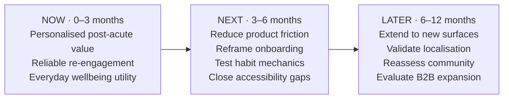

# Outcome Roadmap & Trade-off Memo: Fable Growth

> Module 2 · Prioritization & Roadmapping for Product Leaders, ★ Deliverable 2
>
> Translate the Fable Growth strategy into a multi-team, outcome-driven roadmap and defend the hard prioritization calls behind it.

## 1. Outcome roadmap

_A multi-team roadmap organized by **outcomes**, not feature lists. The roadmap prioritizes Fable's post-acute retention problem: creating durable value for users after their immediate anxiety need has passed._

| Horizon | Outcome / bet | Owning team(s) | Success signal |
|---|---|---|---|
| **Now (0 to 3 mo)** | **We bet personalised post-acute engagement will give users a relevant reason to keep returning after their acute need subsides.** | Product, Data/AI, Engineering, Clinical Advisory | Early post-acute cohorts show movement toward a **30% relative improvement in 180-day retention** versus the pre-initiative baseline. |
| **Now (0 to 3 mo)** | **We bet reliable, contextually timed re-engagement will increase meaningful weekly usage among post-acute users.** | Product, Engineering, CRM/Growth | Post-acute cohorts show movement toward a **25% relative improvement in weekly active usage** versus the pre-initiative baseline, with notification-timing failures materially reduced. |
| **Now (0 to 3 mo)** | **We bet expanding everyday wellbeing value beyond acute anxiety will make Fable useful as an ongoing wellness companion.** | Product, Content, Design, Clinical Advisory | Increased repeat use of meditation, sleep, breathing and short-form wellbeing experiences, with movement toward the retention and premium-renewal KRs. |
| **Next (3 to 6 mo)** | **Reduce friction in the core experience so users can reach value faster and more reliably.** | Engineering, Product | App load time moves from **4.2s toward under 2s on 4G**, while engagement and retention do not regress. |
| **Next (3 to 6 mo)** | **Reset onboarding around Fable as an ongoing wellbeing companion, not only an acute-support product.** | Product, Design, Growth | Improvement from the current onboarding baseline, including reduced drop-off from the **40% observed onboarding drop-off** and stronger progression into post-acute routines. |
| **Next (3 to 6 mo)** | **Test lightweight habit mechanics only where they reinforce demonstrated user value.** | Product, Growth, Design, Data | Habit experiments increase meaningful repeat usage without degrading user trust, satisfaction or notification opt-out rates. |
| **Next (3 to 6 mo)** | **Remove accessibility barriers from the core post-acute experience.** | Product, Design, Engineering, Legal | WCAG 2.1 gaps identified in the audit are closed across the core experience. |
| **Later (6 to 12 mo)** | **Extend proven wellbeing routines into additional surfaces when mobile retention has been validated.** | Product, Engineering, Partnerships | Evidence that wearable or web access increases repeat use among already-retained cohorts rather than merely shifting sessions between surfaces. |
| **Later (6 to 12 mo)** | **Explore geographic expansion only after the post-acute model works in current markets.** | Product, Growth, Content, Localisation | A validated localisation business case for Spanish and Portuguese markets, supported by retention and unit-economics evidence. |
| **Later (6 to 12 mo)** | **Reassess social/community experiences as a distinct retention hypothesis, not as the default growth strategy.** | Product, Growth, Research, Trust/Safety | User research and experiments demonstrate that social accountability adds incremental retention beyond personalised individual engagement without undermining privacy or trust. |
| **Later (6 to 12 mo)** | **Evaluate new business-model expansion only after the core B2C retention model is proven.** | Product, Business Development, Finance | Clear evidence that a B2B “Fable for Teams” proposition can create incremental value without diverting resources from the core post-acute strategy. |

### Roadmap visual

### Strategic traceability

The **Now** horizon is deliberately constrained to the three bets most directly connected to the Module 1 objective:

> **Make Fable a trusted ongoing wellbeing companion that users continue to value after their acute mental-wellness need has passed.**

The three target outcomes are:

- **KR1:** Improve 180-day retention among users entering the post-acute phase by **30% relative to the pre-initiative baseline** by the end of Q4.
- **KR2:** Improve weekly active usage among post-acute users by **25% relative to the pre-initiative baseline** by the end of Q4.
- **KR3:** Improve premium renewal among users entering the post-acute phase by **20% relative to the pre-initiative baseline** by the end of Q4.

_These percentages are project targets. The Fable case does not provide numeric baselines for these three measures, so actual baseline values should be instrumented before final target values are operationalised._

---

## 2. Trade-off memo

### What I sequenced first

> I chose to sequence **personalised post-acute engagement, reliable contextual re-engagement, and recurring everyday wellbeing value** first because they attack Fable's primary strategic problem directly: users leave after their acute anxiety need is resolved.
>
> These bets have the highest **cost of delay** because every quarter without a credible post-acute value proposition allows Fable's most engaged users — including users most likely to convert to premium — to continue churning after the initial 90–120-day use period.
>
> They also create the learning foundation for later investments. If Fable cannot demonstrate that post-acute users want an ongoing relationship with the product, expanding into new surfaces, geographies or business models would scale an unproven retention model rather than solve it.

### What I pushed out

> I pushed out **performance optimisation, onboarding redesign, habit mechanics, accessibility completion, wearable/web expansion, localisation and B2B exploration** because most of these initiatives can improve the experience or expand distribution, but they do not by themselves prove that Fable has a compelling reason to exist after the acute phase.
>
> App performance and accessibility remain important and are sequenced into **Next** because they are foundational quality investments. Onboarding and habit mechanics also move to Next so they can reinforce a validated post-acute proposition rather than optimise users into an experience whose enduring value has not yet been established.
>
> New surfaces, localisation and B2B expansion sit in **Later** because their opportunity cost is high: they consume product, engineering, content and go-to-market capacity while introducing new channels, markets or buyers before the core B2C retention model is proven.

### What I cut entirely from this roadmap

> I cut **therapist matching as a premium growth bet** from this roadmap because it moves Fable toward a clinical-service model, which conflicts with the scenario constraint that Fable cannot reposition as a clinical mental-health platform due to regulatory and liability considerations.
>
> I also refuse to make a **social/community layer** the primary growth strategy in the current horizon. Community remains a later hypothesis that can be reconsidered only if evidence shows that personalised individual engagement is insufficient to create durable post-acute retention.
>
> This preserves strategic coherence: Fable continues to build on the simplicity, privacy and trust of its existing meditation, sleep and breathing foundation while testing whether it can earn an ongoing role in users' everyday wellbeing.

### Prioritization rationale

The sequencing follows three principles:

1. **Impact on the north-star problem:** work earns priority when it can materially improve post-acute retention, meaningful weekly usage or premium renewal.
2. **Cost of delay:** the highest cost sits with learning whether Fable can create durable post-acute value; delaying that learning prolongs the retention crisis.
3. **Opportunity cost:** attractive expansion bets are deferred when they consume scarce cross-functional capacity without resolving the core retention problem.

The roadmap therefore puts the **Rocks first** and prevents visible but less-strategic requests from displacing the work required to validate Fable's post-acute strategy.

---

## Link to full artifact

[Outcome Roadmap & Trade-off Memo](./outcome-roadmap.md)
